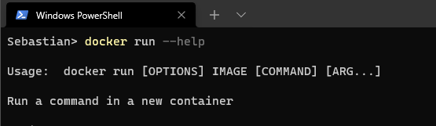
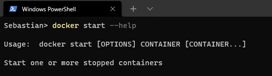

# Getting started

`docker run hello-world` # downloads image if not localy and runs  
`docker pull hello-world` # only download image  
`docker ps`  
`docker ps -a`  
`dokcer start <id||name>` # returns id || name  
`docker start -a <id||name>` # shows result of command in terminal  

-   start -> id or name
-   run -> image name

1. Run: create a new container of an image, and execute the container. You can create N clones of the same image. The command is: `docker run IMAGE_ID` **and not** `docker run CONTAINER_ID`

2. Start: Launch a container previously stopped. For example, if you had stopped a database with the command `docker stop CONTAINER_ID`, you can relaunch the same container with the command `docker start CONTAINER_ID`, and the data and settings will be the same.

`docker image ls`  
`docker run -e <variable> <id||name>` # some require to set env variables  
`docker rm <id|name>`  
`docker system prune [OPTIONS]`   # Remove all unused containers, networks, images (both dangling and unreferenced), and optionally, volumes.
