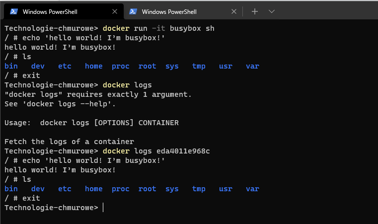

# Docker create cd.

`docker pull busybox`  
`docker run -it busybox sh`  

- -t -> Allocate a pseudo-TTY
- -i -> (--interactiveKeep) STDIN open even if not attached

`echo 'hello world! I’m busybox!'` # print msg  

`docker exec -it eda4011e968c sh`   # Run a command in a running container
`echo "My first file" > readme.txt`   # command inside container shell

Stworzony plik w znjaduje się w innym kontenerze.  
Komenda `docker run` tworzy nowey kontener z obrazu.  

- In order to execute multiple commands using the “docker exec” command, execute “docker exec” with the “sh||bash” process and use the “-c” option to read the command as a string.

`docker exec <container> bash -c "command1 ; command2 ; command3"`  
`docker exec c43ac9f8afb3 sh -c "echo 'Created from outside' > createdFile.txt"`  

