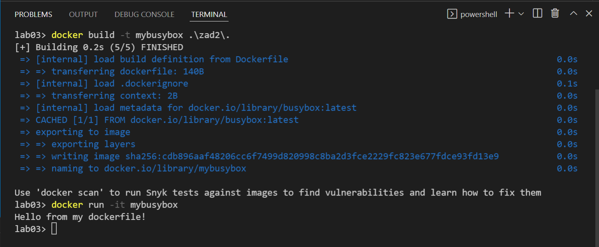
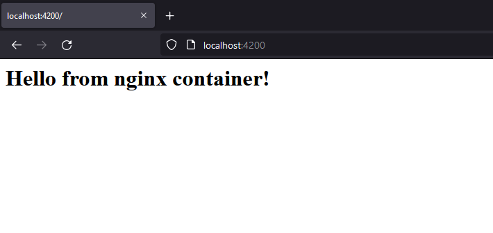

## Dockefile wstęp

# Zadanie 1
`docker run --name some-nginx -d -p 4200:80 nginx:latest`  
-d, --detach -> Run container in background and print container ID  
-p, --publish list -> Publish a container's port(s) to the host  

# Zadanie 2
`docker build -t <nazwa> .`  
`docker build -t mybusybox .\zad2\.`  
`docker run -it mybusybox`  

  

# Zadanie 3
`docker build -t myngnix .\zad3\.`  
`docker run -d -p 4200:80 myngnix`  

  