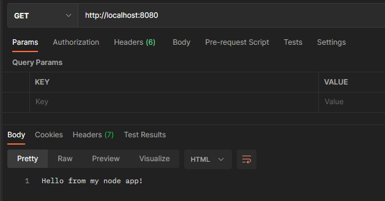

# Dockerfile cd.

## Zadanie 1
`docker build -f .\Dockerfile.dev .`  
`docker run -p 8080:8080 <image id>`  

`EXPOSE`  
1) If you specify neither EXPOSE nor -p, the service in the container will only be accessible from inside the container itself.

2) If you EXPOSE a port, the service in the container is not accessible from outside Docker, but from inside other Docker containers. So this is good for inter-container communication.

3) If you EXPOSE and -p a port, the service in the container is accessible from anywhere, even outside Docker.

  

## Zadanie 2
[docker hub image](https://hub.docker.com/layers/200010465/srychert/express-node/latest/images/sha256-fb94c962d3ceb4e1e6fafb922c71035671e8725700900bca12a87c8a26132fc3?context=repo)
 
