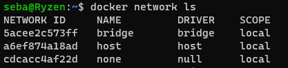

#  Networks, volumes

`docker network connect <nazwa>` Connect a container to a network  
`docker network create <nazwa>` Create a network  
`docker network disconnect <nazwa>` Disconnect a container from a network  
`docker network inspect <nazwa>` Display detailed information on one or more networks  
`docker network ls` List networks  
`docker network rm <nazwa>` Remove one or more networks  
`docker network prune` Remove all unused networks  

## Zadanie 1

`docker run --name first -p 80:80 -d nginx`  
Utworzony kontener należy do sieci bridge

  

- None -> This mode will not configure any IP for the container and doesn’t have any access to the external network as well as for other containers. It does have the loopback address and can be used for running batch jobs.

- Host -> In this mode container will share the host’s network stack and all interfaces from the host will be available to the container. The container’s host name will match the host name on the host system

- Bridge -> It is the Docker default networking mode which will enable the connectivity to the other interfaces of the host machine as well as among containers.
