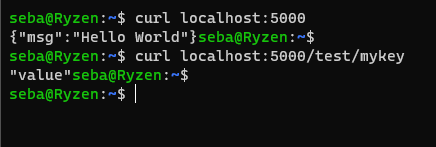

# Docker compose

## Zadanie 1

`docker-compose` Define and run multi-container applications with Docker  
>Builds, (re)creates, starts, and attaches to containers for a service.
>Unless they are already running, this command also starts any linked services.

`docker-compose up` Create and start containers  

>The `docker-compose up` command aggregates the output of each container. When
the command exits, all containers are stopped. Running `docker-compose up -d`
starts the containers in the background and leaves them running.

`docker-compose stop`  
Stop running containers without removing them  

`docker-compose down`  
Stops containers and removes containers, networks, volumes, and images
created by `up`.  
> ` -v, --volumes` -->  Remove named volumes declared in the `volumes` section of the Compose file and anonymous volumes attached to containers.

## Zadanie 2

  