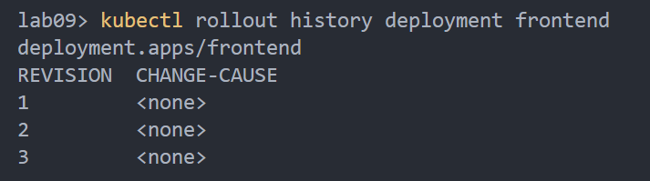

# ReplicaSet

## Zadanie 1
`docker build -t react-frontend -f .\Dockerfile.dev .`  
`kubectl apply -f .\replicaset-forntend.yaml`  

  
  

## Zadanie 2
`docker tag react-frontend:latest react-frontend:release0`  
`kubectl apply -f .\service-frontend.yaml`  
`kubectl rollout status deployment frontend`  

  

`docker build -t react-frontend:release1 -f .\Dockerfile.dev .`  
`kubectl set image deployment/frontend react-frontend=react-frontend:release1`  

  

## Zadanie 3
`kubectl rollout history deployment frontend`  

  

Add `--record` at the end of `kubectl ...` command
 > --record: Record current kubectl command in the resource annotation. If set to false, do not record the command. If set to true, record the command. If not set, default to updating the existing annotation value only if one already exists.

`kubectl rollout undo deployment/frontend`  
`kubectl rollout undo deployment/frontend --to-revision=2`  
