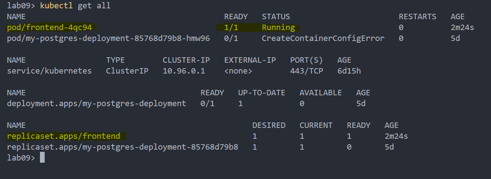
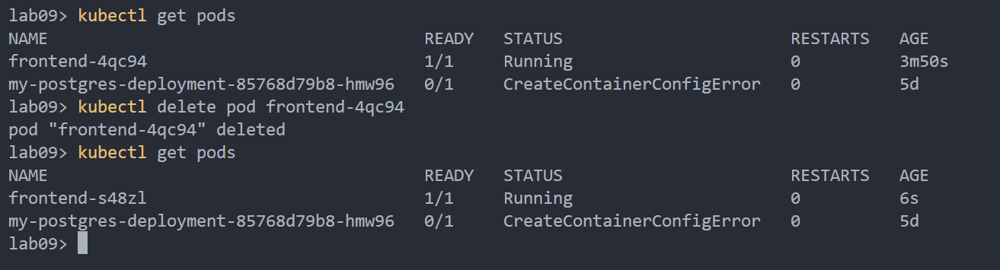
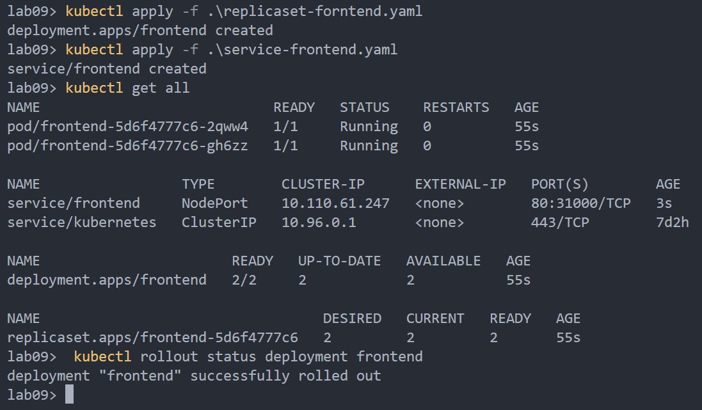
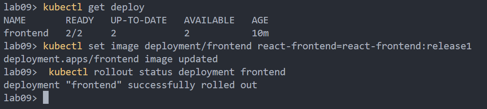

# ReplicaSet

## Zadanie 1
`docker build -t react-frontend -f .\Dockerfile.dev .`  
`kubectl apply -f .\replicaset-forntend.yaml`  

  
  

## Zadanie 2
`docker tag react-frontend:latest react-frontend:release0`  
`kubectl apply -f .\service-frontend.yaml`  
`kubectl rollout status deployment frontend`  

  

`docker build -t react-frontend:release1 -f .\Dockerfile.dev .`  
`kubectl set image deployment/frontend react-frontend=react-frontend:release1`  

  
